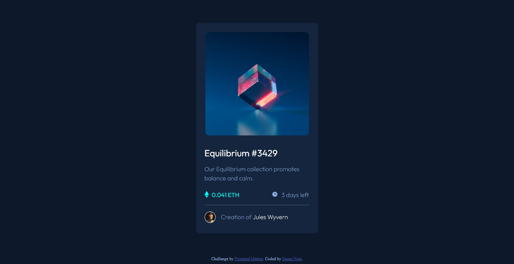

# Frontend Mentor - NFT preview card component solution

This is a solution to the [NFT preview card component challenge on Frontend Mentor](https://www.frontendmentor.io/challenges/nft-preview-card-component-SbdUL_w0U). Frontend Mentor challenges help you improve your coding skills by building realistic projects.

## Table of contents

- [Overview](#overview)
  - [The challenge](#the-challenge)
  - [Screenshot](#screenshot)
  - [Links](#links)
- [My process](#my-process)
  - [Built with](#built-with)
  - [Useful resources](#useful-resources)
- [Author](#author)
- [Acknowledgments](#acknowledgments)

## Overview

### The challenge

Users should be able to:

- View the optimal layout depending on their device's screen size
- See hover states for interactive elements

### Screenshot

### Links

- Solution URL: [https://github.com/negisapna/NFT-Preview-Card-Component](https://your-solution-url.com)
- Live Site URL: [https://negisapna.github.io/NFT-Preview-Card-Component/](https://your-live-site-url.com)

## My process

### Built with

- Semantic HTML5 markup
- CSS custom properties

### Useful resources

- [Hover Effects](https://www.nxworld.net/css-image-hover-effects.html) - This helped me in brining hover effect on the image. I found this pattern understandable and will use it going forward.
- [W3 School](https://www.w3schools.com) - This is an amazing website which helped me finally understand CSS background property.

## Author

- Website - [Sapna Negi](https://negisapna.github.io/CSS---My-Site/)
- Frontend Mentor - [@negisapna](https://www.frontendmentor.io/profile/negisapna)
- Twitter - [@Ne_Sapna](https://www.twitter.com/Ne_Sapna)

## Acknowledgments

I would like to thank [Ayush Vaishnav](https://www.linkedin.com/in/ayush-vaishnav-34656b166) for helping me with concept of selectors in CSS
